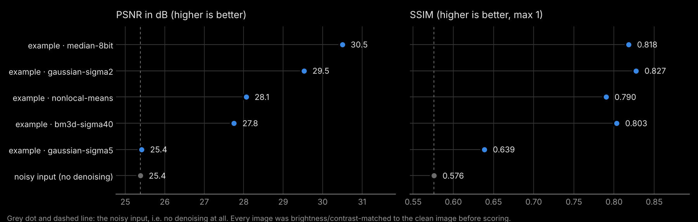

# Denoising, Part 3: how close did we get?

In Parts 1 and 2 nobody could say which result was *right*, because we had no noise-free version of the image. Now we do: [`data/convollaria-clean.tif`](../../data/convollaria-clean.tif) is a low-noise image of exactly the same field of view. Real experiments almost never have such a reference, which is why we kept it hidden until now.

In this part you compare all your results with the clean image, visually and with two numbers.

## Step 1: Collect your results

Copy every denoised image you want to compare into the folder `denoising/benchmark/submissions/`. Name each file

```text
<who>_<what>.tif
```

for example `anna-ben_part1-chatgpt.tif`, `anna-ben_part2-n2v-colab.tif` or `anna-ben_part2-bm3d-sigma40.tif`. Everything before the first `_` is shown as the name of your pair, the rest as the method. Use letters, numbers and dashes only.

Where to find your results:

| Where you denoised | Your result |
|---|---|
| **Part 1** (with AI) | wherever you saved it in Part 1 |
| **Colab track** | in Colab, open the *Files* panel on the left, go to `results/`, right-click `convollaria_denoised.tif` and choose *Download* |
| **Local track** | `denoising/results/convollaria_bm3d_sigma*.tif` and `denoising/results/convollaria_n2v.tif` |

TIFF works best. PNG and JPG are accepted too, but 8-bit formats round away information, so expect slightly worse scores. The image must still be 1024 × 1024 pixels; files of any other size are skipped (and the script tells you).

## Step 2: Run the comparison

You need the clean image. If `data/convollaria-clean.tif` is missing, update the course material first (`git pull`, or download the ZIP again).

**Local track** (uv installs everything the script needs on the first run):

```bash
cd ~/CiliaAI-minicourse
uv run denoising/benchmark/benchmark.py
```

**Colab track:** add a new code cell at the end of the notebook (*+ Code*) and run:

```python
!git clone -q https://github.com/juglab/CiliaAI-minicourse.git
!cp /content/results/*.tif CiliaAI-minicourse/denoising/benchmark/submissions/your-names_part2-n2v-colab.tif
# upload your Part 1 result into CiliaAI-minicourse/denoising/benchmark/submissions/ via the Files panel, then:
!python CiliaAI-minicourse/denoising/benchmark/benchmark.py
from IPython.display import Image, display
display(Image("CiliaAI-minicourse/denoising/benchmark/output/scores.png"))
display(Image("CiliaAI-minicourse/denoising/benchmark/output/images.png"))
```

**Everyone together:** your instructors collect the results of all pairs in one folder and run the same script once for the whole room:

```bash
uv run denoising/benchmark/benchmark.py --folder path/to/all/results
```

## Step 3: Read the output

The script prints a ranking and writes three files to `denoising/benchmark/output/`:

- **`scores.png`**: PSNR and SSIM of every result, best first. The grey dot is the noisy input itself, i.e. what you get without denoising at all.
- **`images.png`**: every result next to the clean image, with two 1:1 crops and an **error map** (result minus clean) for each crop. In the error maps black means "exactly right", blue "too dark" and red "too bright".
- **`scores.csv`**: the numbers, if you want to make your own plots.

**PSNR** (peak signal-to-noise ratio, in dB) measures the average pixel-by-pixel difference to the clean image. Higher is better; +3 dB means roughly half the remaining squared error.

**SSIM** (structural similarity, between 0 and 1) compares local brightness, contrast and structure in small windows, which is closer to how we perceive images. Higher is better; 1 means identical.

**One detail that matters:** tools save their results in different ranges (16-bit, float, 0 to 1, 8-bit PNG). Before scoring, the script therefore rescales each result to best match the brightness and contrast of the clean image (a least-squares fit `a · result + b`). Only the shape of the signal counts, not its units. This is the usual practice in denoising papers, but it is a choice, and other choices give other numbers.

## What it looks like when you are done

Here is an example, made with five quick classical filters instead of your results (Gaussian blur with two strengths, a median filter saved as 8-bit PNG, non-local means, and BM3D):



Notice that the ranking is not obvious: the strong Gaussian blur barely beats doing nothing in PSNR, and the median filter scores best in PSNR but not in SSIM. Your own results will look different.

## Discuss

1. **Does the ranking match your eyes?** Look at `images.png`. Is the result with the best PSNR also the one you would trust most?
2. **PSNR vs SSIM.** Do they agree? Find a pair of results where they do not, and explain why.
3. **What do the error maps show?** Rings or outlines in the error map mean that structure was removed (blurred) or invented. Which methods show that? Is the error the same in bright and in dim regions?
4. **Part 1 vs Part 2.** How did your AI-assisted result from Part 1 compare to the clean restart in Part 2?
5. **Is a high score enough?** Would you now use the best-scoring method for (a) counting cells, (b) measuring membrane intensities? What else would you check?
6. **The big one:** in your own experiments there is no clean image. Which of today's checks still work without it? (Hint: residuals, the same display range, line profiles, your knowledge of the biology.)
