# Bonus: classical denoising in Fiji and napari

This folder is **not part of the exercise**. It is a gallery for after Part 2: what do the classical filters you find in Fiji and napari do to the same image you denoised with Noise2Void?

All Fiji screenshots show the same 256 × 256 crop of [`data/convollaria.tif`](../../data/convollaria.tif): the raw crop on the left, the result in the middle, and the dialog with the settings used on the right.

**Try it yourself:** every Fiji screenshot has a macro in [`fiji_macros/`](fiji_macros/). In Fiji, choose *Plugins > Macros > Run...*, pick a macro, and select `data/convollaria.tif` when asked. Then change the settings (for example the radius) and see what happens. Tip: in Fiji you can find any command by pressing `L` and typing its name.

## Things to look for

- Which filters keep the thin cell walls sharp, and which blur them away?
- Does any filter create structure that is not in the raw image?
- Subtract the result from the raw image (*Process > Image Calculator...*, 32-bit result). If you see cell outlines in that difference image, the filter removed signal, not just noise.
- How does the best classical result compare to your Noise2Void result from Part 2?

## Fiji

### Gaussian blur

Replaces each pixel by a weighted average of its neighbours. Removes noise, but blurs edges just as much.

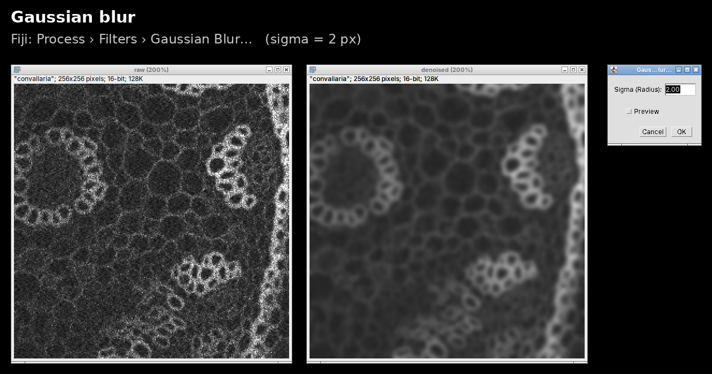

Macro: [`fiji_macros/gaussian.ijm`](fiji_macros/gaussian.ijm)

### Median filter

Replaces each pixel by the median of its neighbourhood. Robust to single bright or dark pixels, keeps edges a little better than a Gaussian.

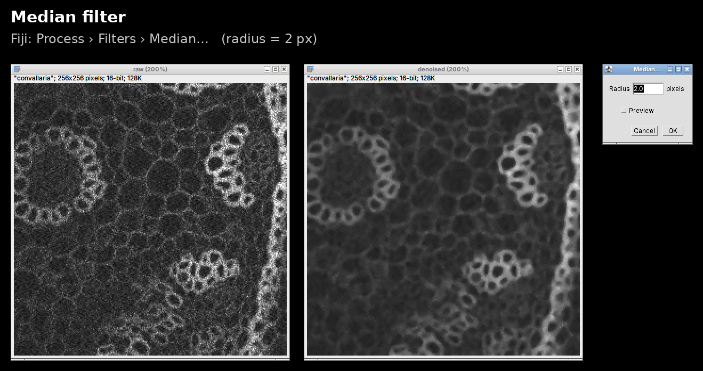

Macro: [`fiji_macros/median.ijm`](fiji_macros/median.ijm)

### Remove outliers

Only replaces pixels that differ strongly from their local median. Great for hot pixels, not meant for noise that is everywhere.

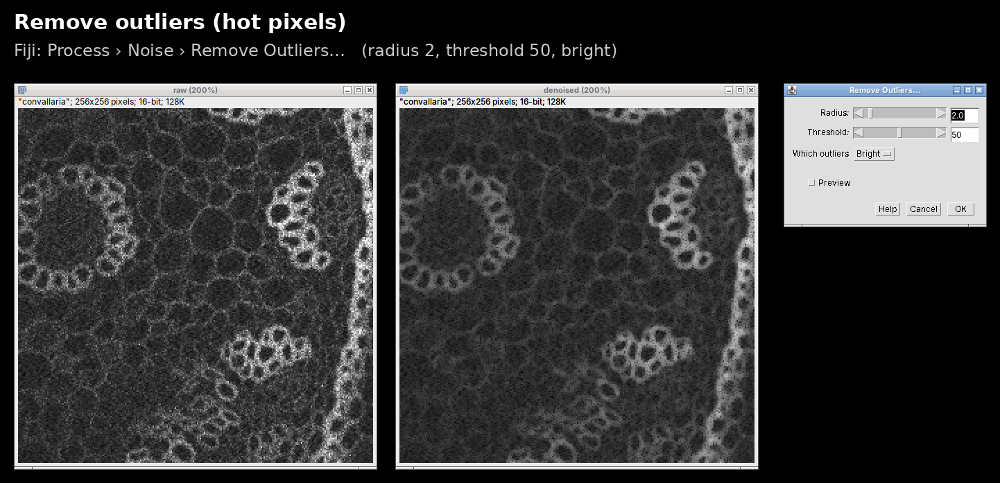

Macro: [`fiji_macros/outliers.ijm`](fiji_macros/outliers.ijm)

### Kuwahara filter

Looks at four sub-windows around each pixel and takes the most uniform one. Preserves edges, gives a "painted" look.

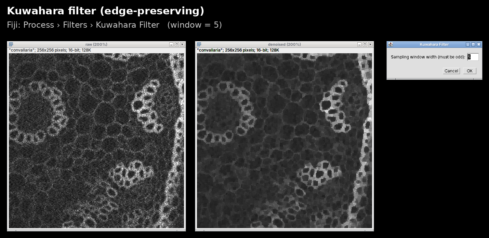

Macro: [`fiji_macros/kuwahara.ijm`](fiji_macros/kuwahara.ijm)

### Bilateral filter

Averages only neighbours that are close in space *and* similar in intensity. Preserves edges.

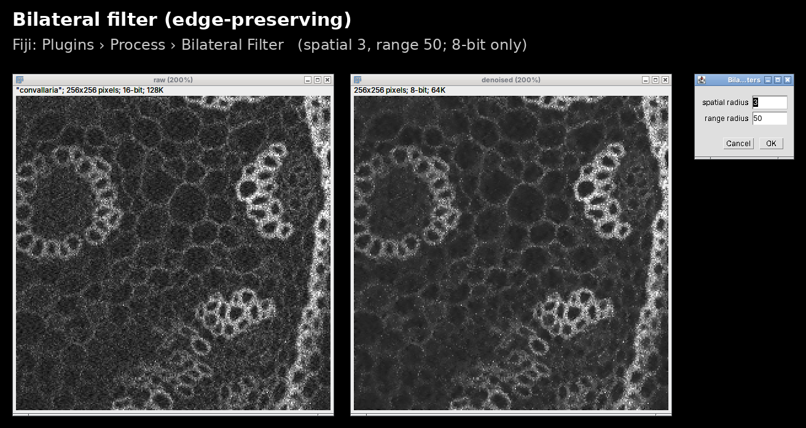

Macro: [`fiji_macros/bilateral.ijm`](fiji_macros/bilateral.ijm)

### Anisotropic diffusion

Smooths along edges but not across them.

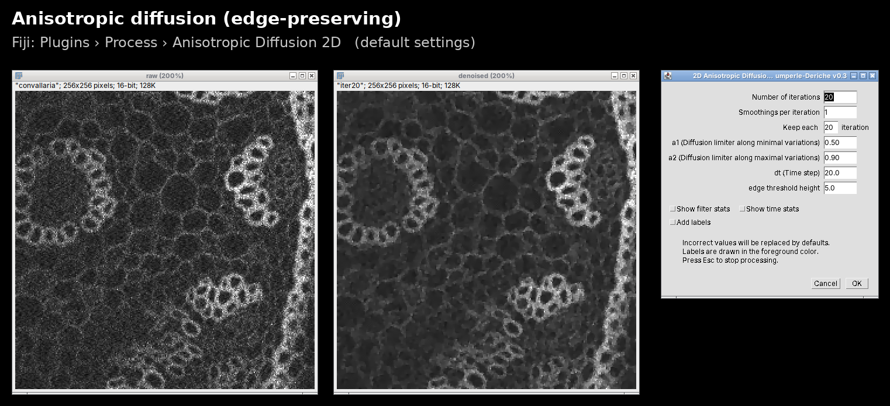

Macro: [`fiji_macros/anisotropic.ijm`](fiji_macros/anisotropic.ijm)

### ROF (total variation)

Finds a piecewise smooth image that stays close to the data. Strong settings give a "cartoon" look.

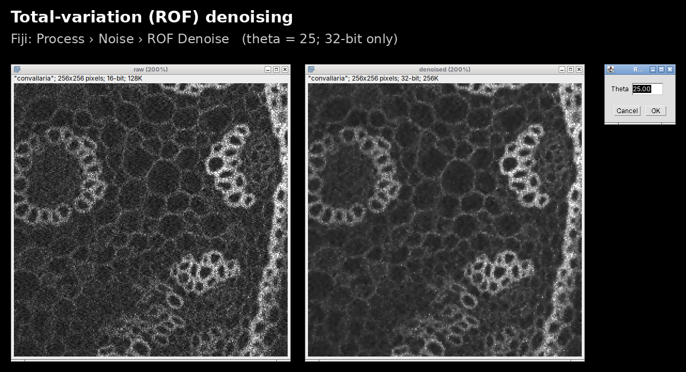

Macro: [`fiji_macros/rof.ijm`](fiji_macros/rof.ijm)

### Rolling ball (background subtraction)

**Not a denoiser.** Removes slowly varying background, the noise stays. Included because the two are often confused.

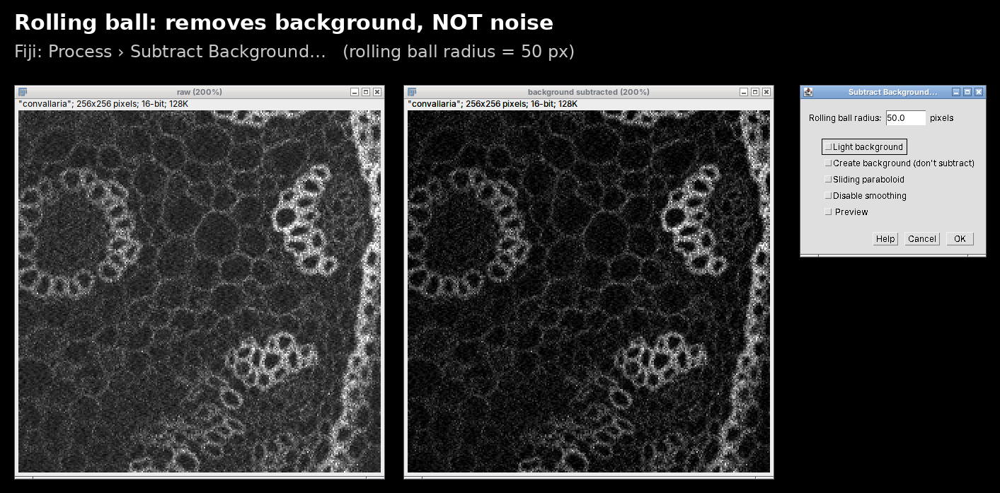

Macro: [`fiji_macros/rollingball.ijm`](fiji_macros/rollingball.ijm)

## napari

napari has the same kinds of filters through plugins, for example [napari-simpleitk-image-processing](https://github.com/haesleinhuepf/napari-simpleitk-image-processing) (screenshots from its README, by Robert Haase, BSD-3-Clause):

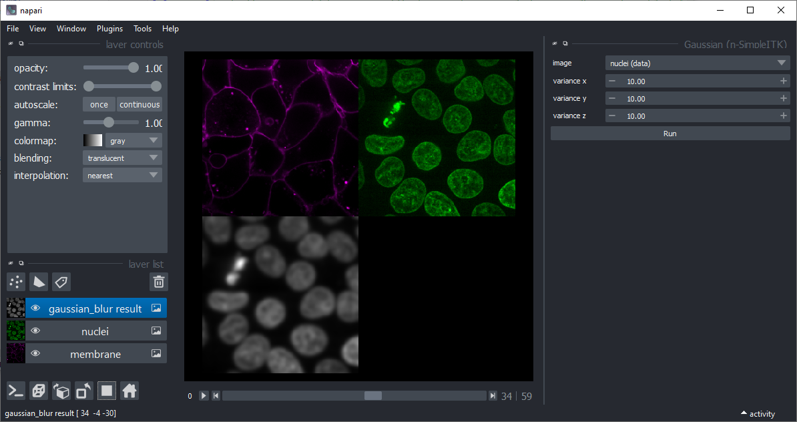

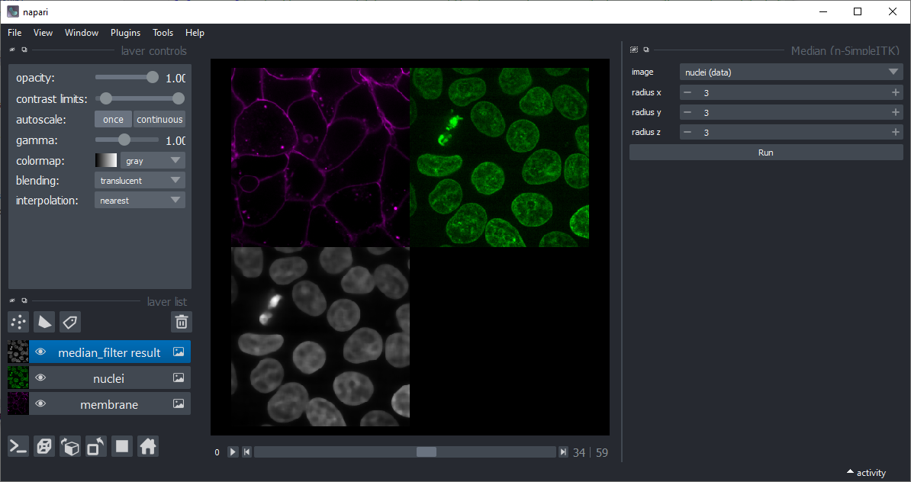

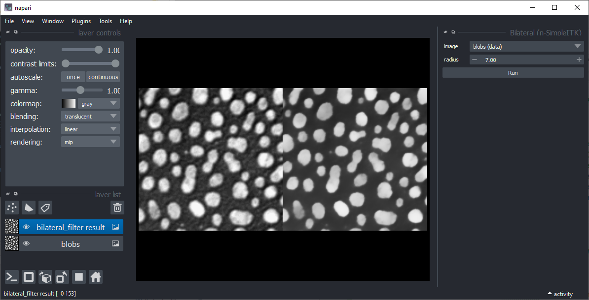

The [napari-assistant](https://github.com/haesleinhuepf/napari-assistant) (Robert Haase, BSD-3-Clause) lets you click such filters together into a workflow and export it as Python code:

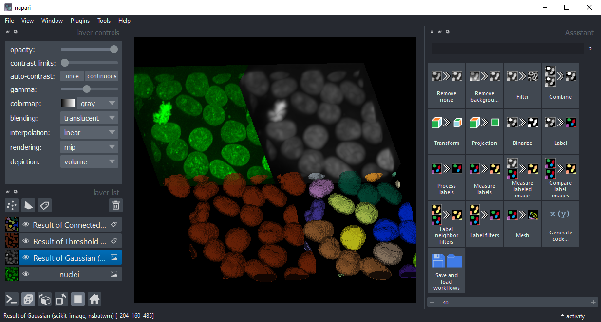

Sources and licenses of all images: [`SOURCES.md`](SOURCES.md).
